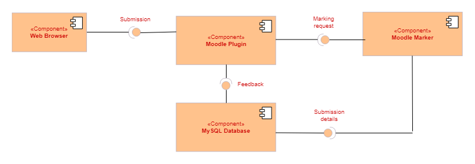
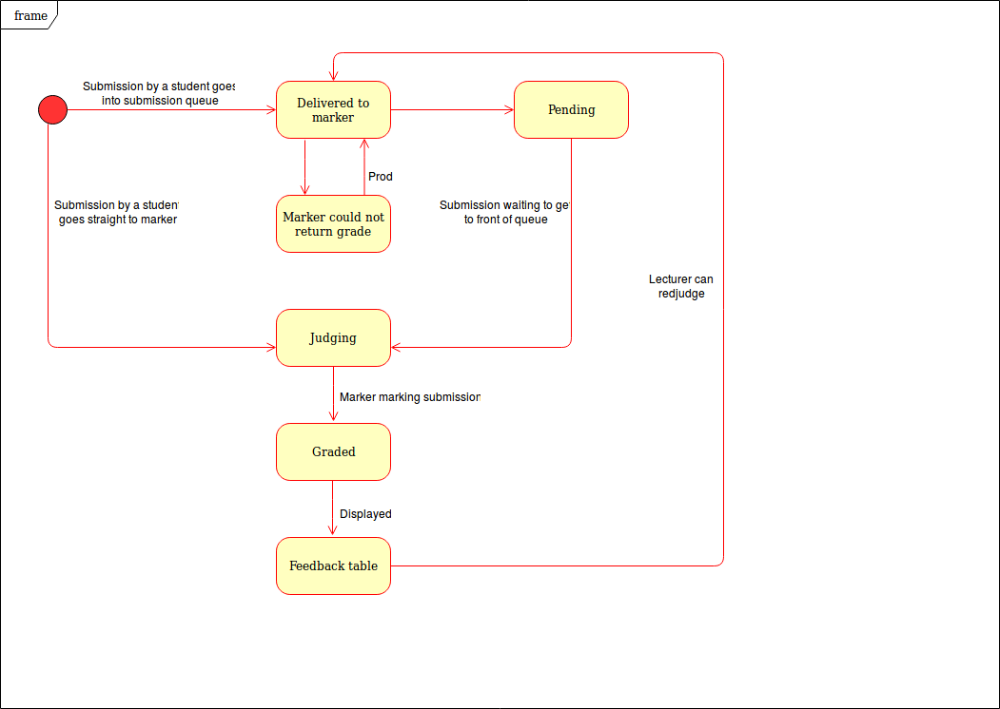
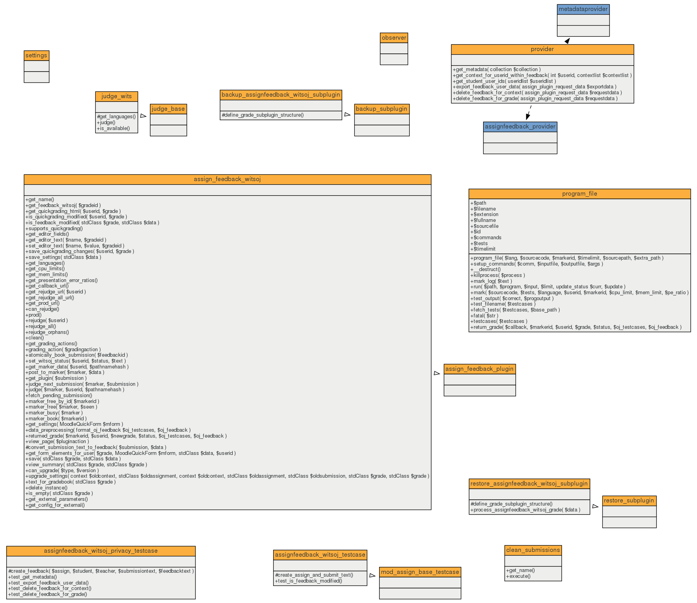
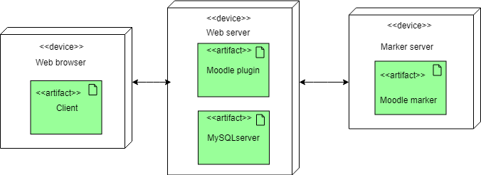
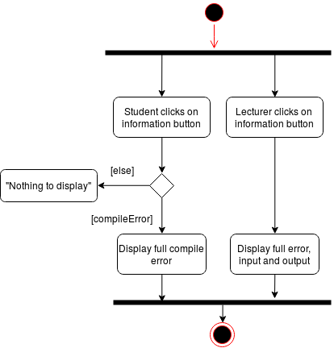
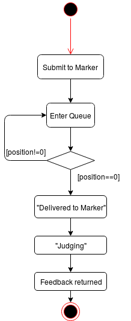
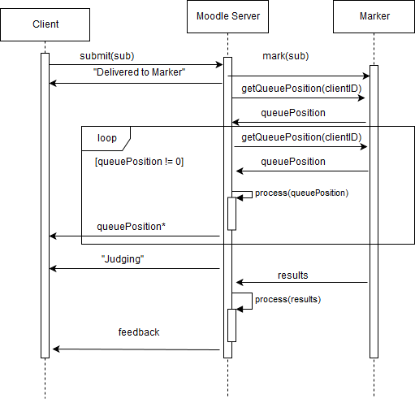
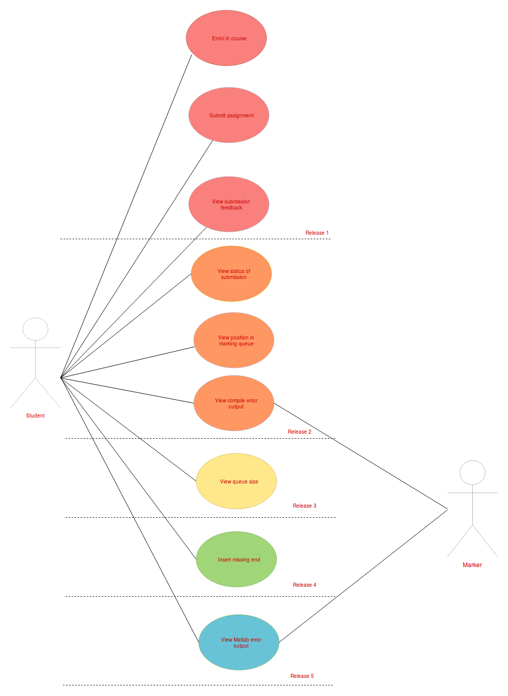

# High Level Architectural Descriptions

## [UML Diagrams](https://www.smartdraw.com/uml-diagram/)

## Description of viewpoints:
 

### **Development view:** 
 

**Component Diagram:** 
Describes the organization and wiring of the physical components in a system. A component diagram breaks down the actual system that is being developed into different high levels of functionality.  
- [Examples](https://www.visual-paradigm.com/guide/uml-unified-modeling-language/what-is-component-diagram/)

1. The diagram below illustrates the different system components. The system has 4 components. The web browser interacts with the Moodle plugin through an interface and can not interact directly with the Moodle marker component. Both the Moodle marker and plugin components receive data from the database component.
  

  

### **Logical view:** 
There are two main diagrams which describe the logical view of a software system:
- [State Diagram](https://www.geeksforgeeks.org/unified-modeling-language-uml-state-diagrams/)
- [Class Diagram](https://www.visual-paradigm.com/guide/uml-unified-modeling-language/what-is-class-diagram/)
  

**State Diagram:**
 
A state diagram basically describes the different states a software system can go into. It represents parts of a system at a finite instance of time.

1. The state diagram below shows the different states of a submission as it is being processed.  
  

**Class Diagram:**
 
A class diagram describes the structure of a software system by showing the system's classes, attitubes, methods, relationships etc.
 
2. The diagram below is a UML class diagram to help describe the logical view of our system. It shows a break down of different classes and related methods. The diagram was generated by using the code.  

  

### **Physical view:**  
**Deployment Diagram:**
 
A deployment diagram is a structural diagram used to model the physical aspects of an object-oriented system.
 
1. The deployment diagram below shows the 3 devices used in the system.  
   
  

- **[Examples](https://www.lucidchart.com/pages/uml-deployment-diagram)** 

### **Process view:** 
There are two main diagrams which describe the process view of a software system:
- Activity Diagram
- Sequence Diagram

These diagrams are also reffered to as behavihour diagrams.
 
- **[Examples](https://www.geeksforgeeks.org/difference-between-sequence-diagram-and-activity-diagram/)** 

**Activity Diagram:** 
An activity diagram is a basic flow chart diagram which is used to describe the flow of an activity in a system. The activity diagrams below shows the full process of the features that have been added:
 
 

1. This activity diagram depicts how a student or lecturer is able to view the output of the compiler.
 

 

2. Here we see the process of a submission moving through the queue to be marked and what a student sees.
 

**Squence Diagram:** 
An squence diagram illustrates the interaction between objects in your system in a squential order. Ideally they describe how and in what order the objects in a system function. The following sequence diagrams further describe the process view:
  

1. This sequence diagram describes how the queue position is updated.
  

 

### **Scenarios:**    

**Use Case Diagram:** 
A use case diagram is the primary form of system/software requirements for a new software system. They specify the expected behaviour and the not so exact method of making it happen.

- [Examples](https://www.visual-paradigm.com/guide/uml-unified-modeling-language/what-is-use-case-diagram/)

1. Below is an example of a student use case showing the new features available to the students in each release.
  

